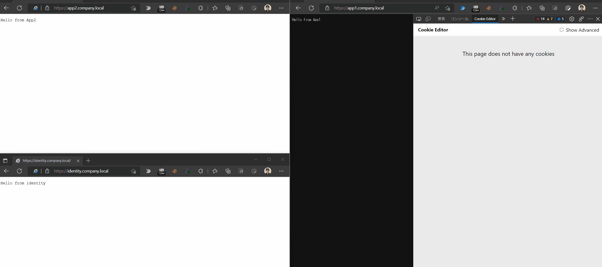

# IEModeSample
Microsoft Edge IEモードの動作確認のために作成したサンプルWebアプリケーションです。
* [流用元](https://github.com/dotnet/AspNetCore.Docs/tree/main/aspnetcore/security/authentication/cookie/samples/3.x/CookieSample)
* [Use cookie authentication without ASP.NET Core Identity](https://docs.microsoft.com/en-us/aspnet/core/security/authentication/cookie?view=aspnetcore-6.0)
* [Cookie sharing from Microsoft Edge to Internet Explorer](https://docs.microsoft.com/en-us/deployedge/edge-ie-mode-add-guidance-cookieshare)

## Prerequisite
* .NET 7.0

## Getting Started
### CookieSample
* エンタープライズモードサイトリストの構成。
    * https://docs.microsoft.com/en-us/deployedge/edge-ie-mode-policies#configure-sites-on-the-enterprise-site-list
    * [`sites.xml`](sites.xml)をサイトリストに設定。

* Webアプリ起動。もしくは https://ie-mode-sample-webapp.azurewebsites.net/ にアクセス。
    ```powershell
    cd .\src\CookieSample\
    dotnet run
    ```

* ローカルで起動した場合、Edgeで https://localhost:5001 にアクセス。

### CookieSso


1. Install Caddy: Reverse Proxy
    ```powershell
    choco install caddy
    ```

1. Install redis-server: [ASP.NET Core Data Protection](https://docs.microsoft.com/en-us/aspnet/core/security/data-protection/introduction?view=aspnetcore-6.0)
    ```bash
    sudo apt install redis-server
    ```

1. Update `C:\Windows\System32\drivers\etc\hosts`
    ```
    127.0.0.1       identity.company.local
    127.0.0.1       app1.company.local
    127.0.0.1       app2.company.local
    ```

1. Start Redis server
    ```bash
    sudo service redis-server start
    ```

1. Start Caddy
    ```bash
    caddy run
    ```

1. Start apps
    ```powershell
    dotnet watch --no-hot-reload --project .\src\CookieSso.Identity\
    dotnet watch --no-hot-reload --project .\src\CookieSso.App1\
    dotnet watch --no-hot-reload --project .\src\CookieSso.App2\
    ```

1. Access https://identity.company.local/login
    * The page is shown in IE mode
    * "ok" response is returned
    * A domain cookie `CookieSso.Identity` is set

1. Access https://app1.company.local/protected
    * The page is shown in native Edge mode
    * "secret" response is returned

1. Access https://app2.company.local/protected
    * The page is shown in IE mode
    * "secret" response is returned

1. Check data protection keys
    ```bash
    redis-cli
    127.0.0.1:6379> keys *
    1) "DataProtection-Keys"
    ```

## テストユーザー
* ユーザー名: Maria Rodriguez
* メールアドレス: maria.rodriguez@contoso.com
* パスワード: 任意

## シナリオ
### 1. `window.open` の挙動の違い

### 2. Edge -> IEモードのセッションCookieは共有できるがその逆は不可
* Edge -> IEモード (Cookieが共有されている場合)
    
* Edge -> IEモード (Cookieが共有されていない場合)
    

* Cookieが共有されていても、IEモード -> Edge の方向は不可
    
