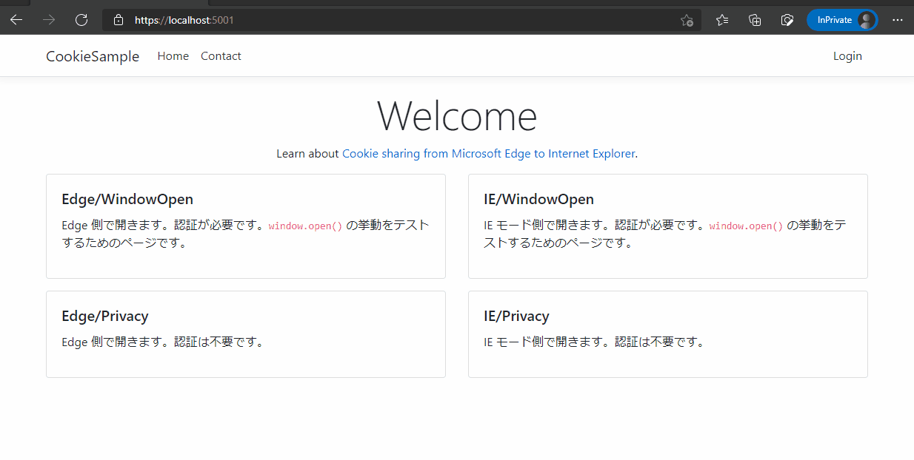

# IEModeSample
Microsoft Edge IEモードの動作確認のために作成したサンプルWebアプリケーションです。
* [流用元](https://github.com/dotnet/AspNetCore.Docs/tree/main/aspnetcore/security/authentication/cookie/samples/3.x/CookieSample)
* [Use cookie authentication without ASP.NET Core Identity](https://docs.microsoft.com/en-us/aspnet/core/security/authentication/cookie?view=aspnetcore-6.0)
* [Cookie sharing from Microsoft Edge to Internet Explorer](https://docs.microsoft.com/en-us/deployedge/edge-ie-mode-add-guidance-cookieshare)

## Prerequisite
* .NET 6.0

## Getting Started
* エンタープライズモードサイトリストの構成。
    * https://docs.microsoft.com/en-us/deployedge/edge-ie-mode-policies#configure-sites-on-the-enterprise-site-list
    * [`sites.xml`](sites.xml)をサイトリストに設定。
* Webアプリ起動。
    ```powershell
    cd .\src\CookieSample\
    dotnet run
    ```
* Edgeで https://localhost:5001 にアクセス。

## テストユーザー
* ユーザー名: Maria Rodriguez
* メールアドレス: maria.rodriguez@contoso.com
* パスワード: 任意

## シナリオ
### 1. `window.open` の挙動の違い

### 2. Edge -> IEモードのセッションはCookieは共有できるがその逆は不可
* Edge -> IEモード (Cookieが共有されている場合)
    
* Edge -> IEモード (Cookieが共有されていない場合)
    

* Cookieが共有されていても、IEモード -> Edge の方向は不可
    
